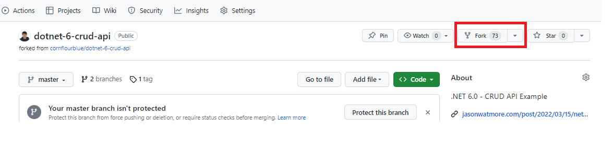
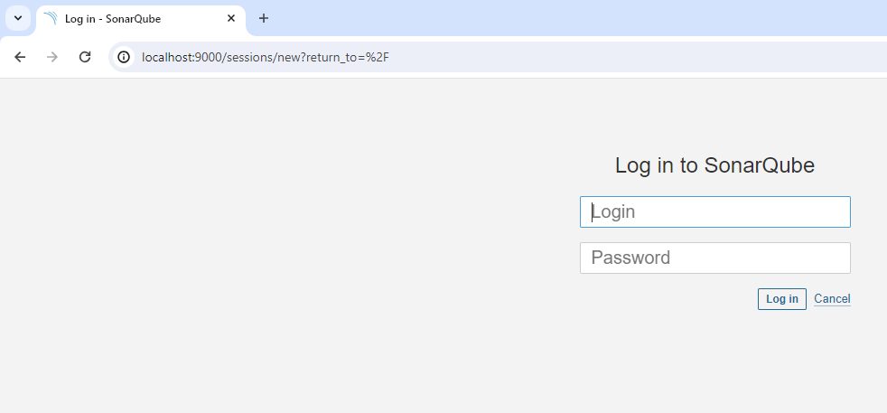
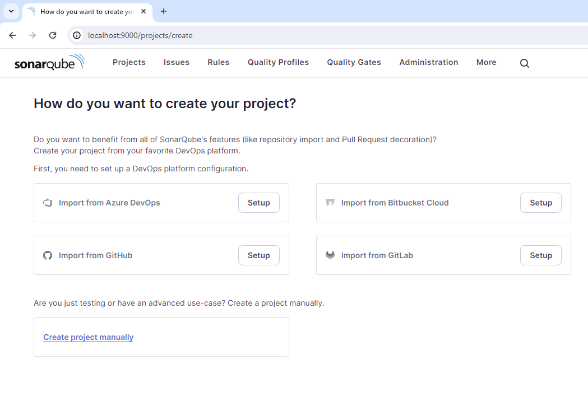
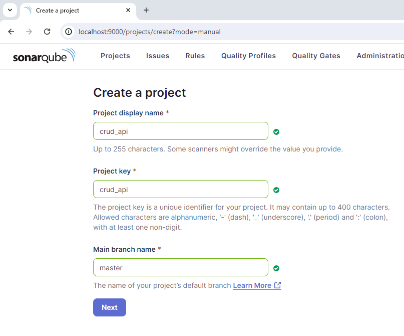
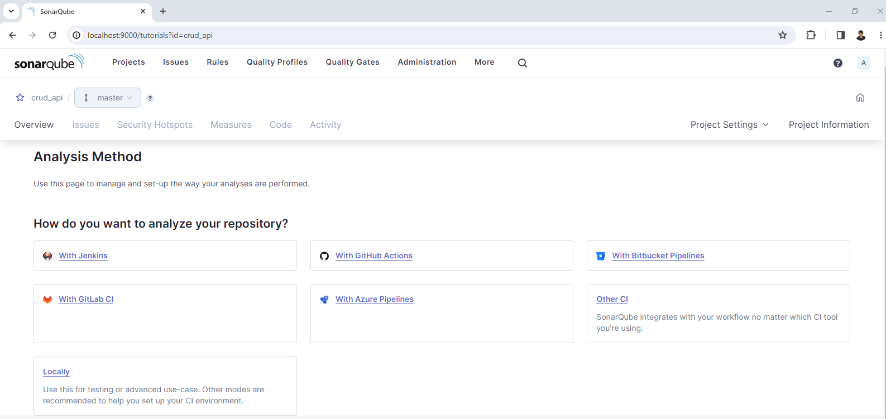
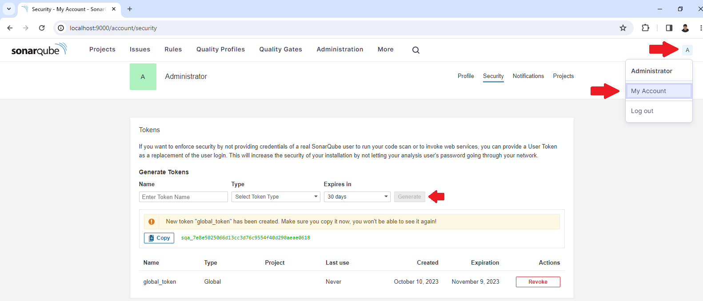
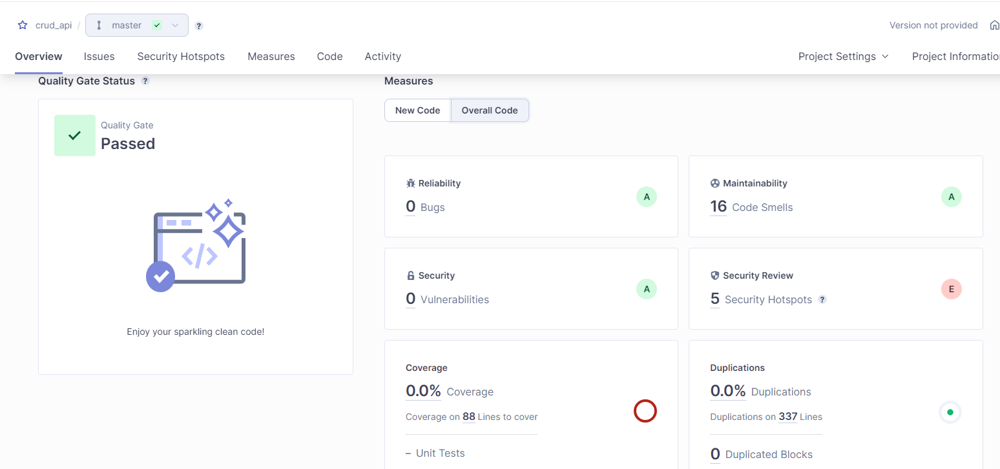

# LAB 1 - SAST

En aquest laboratori, aprendrem a fer servir l'eina [SonarQube](https://www.sonarsource.com/products/sonarqube/) i les funcionalitats que incorpora referent a l'anàlisi estàtic de codi.
També veurem com fer servir l'eina standalone CLI [Semgrep](https://github.com/returntocorp/semgrep)

Requisits:

- [Docker](https://docs.docker.com/)
- [Git](https://git-scm.com/)
- [Postman](https://www.postman.com/)

## Clone del projecte

Primer de tot, farem un fork i un clone del projecte que analitzarem en aquesta pràctica.
(<https://github.com/TheMatrix97/dotnet-6-crud-api>)




```bash
git clone https://github.com/<Usuari>/dotnet-6-crud-api.git
````


## SonarQube

```bash
docker volume create sonar_data
docker run -d --name sonarqube -p 9000:9000 -v sonar_data:/opt/sonarqube/data sonarqube
```

A continuació, obrirem un navegador i accedirem a `http://localhost:9000`. On hauriem de veure la pantalla de login de SonarQube



Haurem d'accedir amb l'usuari `admin`, password `admin`. A continuació, ens demanarà canviar el password per un de diferent i ja hauriem de vuere el dashboard principal de l'aplicació



### Creació del projecte

Primer de tot, crearem un projecte nou manualment, que fara referencia a la nostra API. Fent click a la opció `Create projecte manually`

En aquest exemple, li indicarem el nom i clau de projecte `crud_api`, definint la branch `master` com a la principal del projecte



A continuació li indicarem que detecti qualsevol canvi com a codi nou, amb l'opció `Use the global setting`

Si tot ha anat bé, ara hauriem de veure la vista del projecte buida



### Generació de l'API Token

Per poder executar el `sonar-scanner` haurem de generar un token d'analisi, per fer-ho, haurem d'accedir a l'apartat de seguretat i generar un token global, que ens permetrà analitzar qualsevol projecte



**Apunta el Token en un Notepad!** No es tornarà a mostrar

### Analisi de codi

En aquest punt, ja podem executar el primer escaneig de codi. Hem de tenir en compte que SonarQube disposa de diferents escaners especialitzats, segons l'eina que fem servir per compilar el projecte:
- Gradle
- .NET
- Maven
- Ant

i un gèneric `SonarScanner`. Segons el projecte, ens pot interesar fer servir el escaner especific, ja que ens proporcionarà més informació que el generic.

Per més informació pots consultar la documentació de SonarQube referent als [Scanners](https://docs.sonarsource.com/sonarqube/9.9/analyzing-source-code/scanners/sonarscanner/).

En el nostre cas, com que la API està programada en dotnet 6.0, farem servir el `Scanner` de .NET, que funciona mitjançant MSBuild.

Actualment SonarQube no proporciona cap imatge del `Scanner` per .NET, només està disponible el generic a [DockerHub](https://hub.docker.com/r/sonarsource/sonar-scanner-cli).

Per aquest laboratori, farem servir una imatge Docker custom que inclou l'eina SonarScanner per .NET, amb MSBuild i les seves dependencies (https://github.com/TheMatrix97/dotnet-sonar). 

Només haurem de substituir els següents paràmetres:

- **$HOST**: `http://host.docker.internal:9000` -> (Host local)
- **$TOKEN**: `sqa_*` -> (Token d'autenticació que hem obtingut al pas anterior)
- **$KEY**: `crud_api` -> (Identificador el projecte)
  
```bash
cd dotnet-6-crud-api
docker run -it --rm -v .:/source ghcr.io/thematrix97/dotnet-sonar:latest sh -c "cd source \
    && dotnet /sonar-scanner/SonarScanner.MSBuild.dll begin /k:$KEY /d:sonar.host.url=$HOST /d:sonar.login=$TOKEN \
    && dotnet restore \
    && dotnet build -c Release \
    && dotnet /sonar-scanner/SonarScanner.MSBuild.dll end /d:sonar.login=$TOKEN"
```

Si tot ha anat bé, hauriem de veure el següent output:

```txt
....
INFO: More about the report processing at http://host.docker.internal:9000/api/ce/task?id=AYsaK9XcdZb1SavooNVE
INFO: Analysis total time: 14.143 s
INFO: ------------------------------------------------------------------------
INFO: EXECUTION SUCCESS
INFO: ------------------------------------------------------------------------
INFO: Total time: 21.857s
INFO: Final Memory: 20M/77M
INFO: ------------------------------------------------------------------------
The SonarScanner CLI has finished
```

Com podeu veure al dashboard, tenim 5 `Security Hostspots` que hauriem de revisar per veure si poden ser problemes de seguretat.
Quins problemes té aquest codi?



## Semgrep

Semgrep es distribueix com a eina CLI mitjaçant PyPI, en el nostre cas, farem servir la [imatge Docker oficial](), així en estalviarem l'instal·lació de l'eina.

```bash
docker pull returntocorp/semgrep
```

Si executem la comanda help, hauriem de veure el `usage` de l'eina CLI

```bash
docker run --rm returntocorp/semgrep semgrep --help
```
```txt
Usage: semgrep [OPTIONS] COMMAND [ARGS]...
```

Executem l'eina d'escaneig en [mode offline](https://semgrep.dev/docs/getting-started/), mapejant el contingut del projecte al path `/src`

```bash
docker run --rm -v .:/src returntocorp/semgrep semgrep scan --config=auto
```

**Quines vulnerabilitats ha trobat? Més o menys que a SonarQube?**


### Integració amb GitHub Actions

Aquesta eina disposa d'una acció de GitHub que permet la creació de workflows de GitHub Actions que inclouen l'anàlisi SAST amb Semgrep. Aquesta acció està actualment deprecada, i és recomana fer servir la imatge docker `returntocorp/semgrep`.

**Pots crear un workflow de Github actions que executi un escaneig offline?**

**Com ho faries per exportar el resultat a SARIF i importar-lo a GitHub?**

Consulta la següent documentació:
- <https://semgrep.dev/docs/semgrep-ci/sample-ci-configs/>
- <https://semgrep.dev/docs/cli-reference/>
- <https://docs.github.com/en/code-security/code-scanning/integrating-with-code-scanning/uploading-a-sarif-file-to-github>