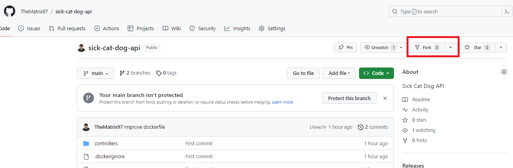
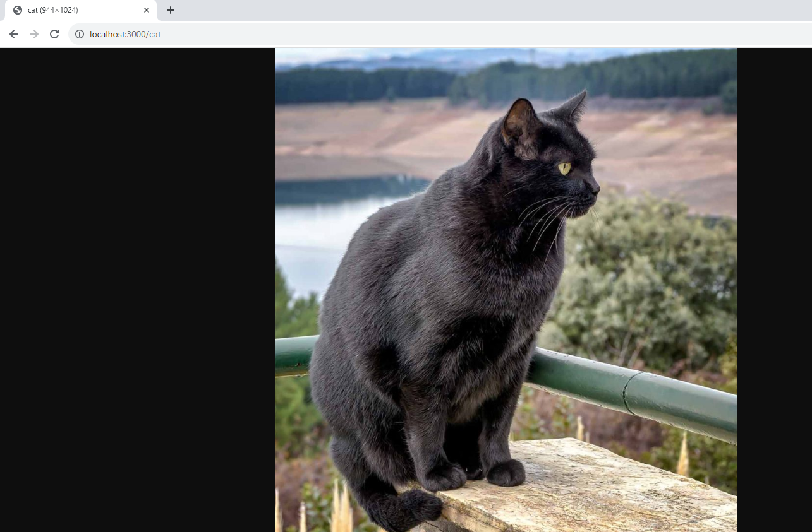

# LAB 3 - SCA

En aquest laboratori, aprendrem a fer servir l'eina [Trivy](https://trivy.dev/) per llistar i analitzar dependencies de repositoris remots.

Requisits:

- [Docker](https://docs.docker.com/)
- [Git](https://git-scm.com/)

Aquesta eina opensource és un dels scanners de seguretat més populars.

- Targets (que pot analitzar trivy):

  - Container Image
  - Filesystem
  - Git Repository (remote)
  - Virtual Machine Image
  - Kubernetes
  - AWS

- Scanners (que pot trobar trivy):
  - OS packages and software dependencies in use (SBOM)
  - Known vulnerabilities (CVEs)
  - IaC issues and misconfigurations
  - Sensitive information and secrets
  - Software licenses

## Instal·lació Trivy

Trivy està disponible en els repositoris de packets més utilitzats i només està disponible per Linux. Donada aquesta limitació, i per evitar la instal·lació de paquets, farem servir la [imatge Docker oficial](https://hub.docker.com/r/aquasec/trivy/) per executar l'eina.

```bash
docker pull aquasec/trivy:0.46.0
```

## sick-cat-dog-api

En aquesta pràctica, farem servir el projecte [`sick-cat-dog-api`](https://github.com/TheMatrix97/sick-cat-dog-api). És tracta d'una `API REST` escrita en `NodeJS` fent servir el framework [`Express`](https://www.npmjs.com/package/express).

Aquesta API té 2 endpoints:

- `GET /cat`
  - Torna una imatge d'un gat aleatoria
- `GET /dog`
  - Torna una imatge d'un gos aleatoria


Feu un fork del projecte:



i cloneu el projecte en local

```bash
git clone https://github.com/TheMatrix97/sick-cat-dog-api.git
```

Podeu executar la api en local per verificar que funciona bé.
Només hem de generar la imatge Docker

```bash
docker build -t sick-cat-dog-api:latest .
```

i executem la imatge amb la comanda `docker run` mapejant el port 3000 del contenidor al nostre host.

```bash
docker run -d -p 3000:3000 sick-cat-dog-api:latest
```

Si s'ha executat correctament, hauriem de trobar-nos amb un gat aleatori al navegar a `http://localhost:3000/cat`



o un gos, si ho preferim `http://localhost:3000/dog`

## SCA amb Trivy

Volem pujar a producció aquesta aplicació, per a que els treballadors de la nostra empresa i socis puguin accedir a imatges d'animals de forma il·limitada.
Però, abans de res, haurem d'analitzar la imatge Docker, revisant possibles vulnerabilitats de les dependencies o errors de configuració.

Per fer-ho, crearem un contenidor Docker temporal per poder executar l'eina, generant previament un volum per a que Trivy pugui fer caché de la base de dades de vulnerabilitats, i accelerar posteriors execucions.

```bash
docker volume create trivy_cache
```

```bash
docker run --rm -v //var/run/docker.sock:/var/run/docker.sock -v trivy_cache:/root/.cache/ aquasec/trivy:0.46.0 image sick-cat-dog-api:latest
```

**TODO:** Identifica les diferents vulnerabilitats que té la imatge i a que fan referencia.

<details>
<summary>Hint</summary>

- Vulnerabilitats de la imatge base `node-18*-buster`

- Secrets

- Vulnerabilitats NPM (package.json)
</details>


**TODO:** Intenta solucionar totes les vulnerabilitats que has trobat, aconseguint que Trivy no generi cap error. *(No fa falta tocar el source del codi)*

## Integració amb CI/CD

El nostre `jefe` ens ha demanat implementar un pipeline CI/CD que publiqui la imatge al repositori de GitHub quan generem una release nova, però, abans s'haurà d'executar l'eina de Trivy i marcar la pipeline com a fallida si es troba una vulnerabilitat de categoria alta o crítica (`HIGH` i/o `CRITICAL`).

**Com afegirieu el pas de verificació amb Trivy?**

Podeu fer servir la documentació de Github Actions per aprendre a generar i publicar imatges a DockerHub (<https://docs.github.com/en/actions/publishing-packages/publishing-docker-images>)

```yml
name: Create and publish a Docker image

# Configures this workflow to run every time a change is pushed to the branch called `release`.
on:
  release:
    types: [published]

# Defines two custom environment variables for the workflow. These are used for the Container registry domain, and a name for the Docker image that this workflow builds.
env:
  REGISTRY: ghcr.io
  IMAGE_NAME: ${{ github.repository }}

# There is a single job in this workflow. It's configured to run on the latest available version of Ubuntu.
jobs:
  build-and-push-image:
    runs-on: ubuntu-latest

    # Sets the permissions granted to the `GITHUB_TOKEN` for the actions in this job.
    permissions:
      contents: read
      packages: write
    
    steps:
      - name: Checkout repository
        uses: actions/checkout@v4
      # Uses the `docker/login-action` action to log in to the Container registry registry using the account and password that will publish the packages. Once published, the packages are scoped to the account defined here.

      - name: Log in to the Container registry
        uses: docker/login-action@65b78e6e13532edd9afa3aa52ac7964289d1a9c1
        with:
          registry: ${{ env.REGISTRY }}
          username: ${{ github.actor }}
          password: ${{ secrets.GITHUB_TOKEN }}

      # This step uses [docker/metadata-action](https://github.com/docker/metadata-action#about) to extract tags and labels that will be applied to the specified image. The `id` "meta" allows the output of this step to be referenced in a subsequent step. The `images` value provides the base name for the tags and labels.

      - name: Extract metadata (tags, labels) for Docker
        id: meta
        uses: docker/metadata-action@9ec57ed1fcdbf14dcef7dfbe97b2010124a938b7
        with:
          images: ${{ env.REGISTRY }}/${{ env.IMAGE_NAME }}
      
      # This step uses the `docker/build-push-action` action to build the image, based on your repository's `Dockerfile`. If the build succeeds, it pushes the image to GitHub Packages.
      # It uses the `context` parameter to define the build's context as the set of files located in the specified path. For more information, see "[Usage](https://github.com/docker/build-push-action#usage)" in the README of the `docker/build-push-action` repository.
      # It uses the `tags` and `labels` parameters to tag and label the image with the output from the "meta" step.

      - name: Build and push Docker image
        uses: docker/build-push-action@f2a1d5e99d037542a71f64918e516c093c6f3fc4
        with:
          context: .
          push: true
          tags: ${{ steps.meta.outputs.tags }}
          labels: ${{ steps.meta.outputs.labels }}

```